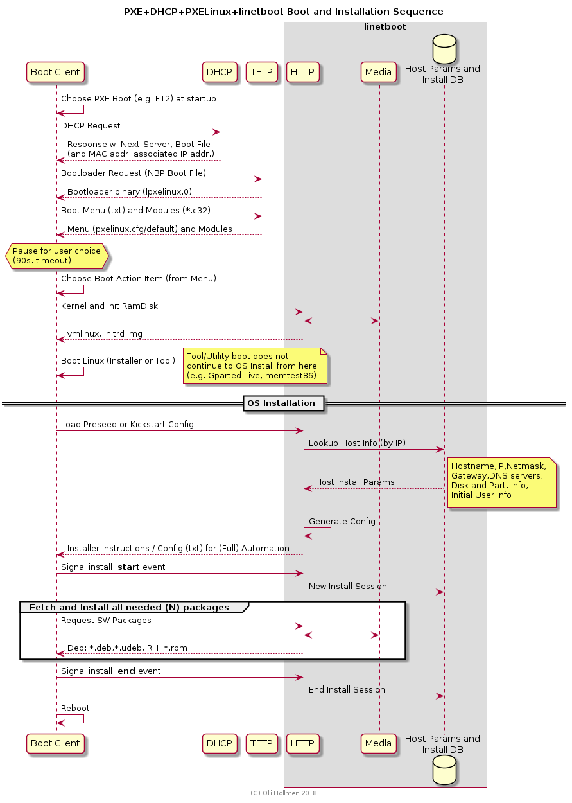

# Linux NetBoot and Installation System Layout

The sequence of booting installer and installing an OS with netinstall:

<!--
    |------------| |-----------|  |---------|      |----------------------|
    | DHCP       | | TFTP      |  | HTTP    |      | HTTP Package mirror  |
    | Server     | | Server    |  | Server  |      | Server               |
    | - NBP Name | | - NBP File|  | - Kernel|      | - udeb, deb packages |
    | - TFTP Name| | - Menus   |  | - InitRD|      |
    |____________| |___________|  | - preseed.cfg
-->

# Overview of Network boot and Install Subsystems

## DHCP Server

PXE Booting standard and respective implementtaions start by consulting local DHCP server for IP address, "Boot file" and "Next Server". The next server allows a server other than DHCP server to handle delivery of "Boot file".

Hopefully you get to utilize an existing DHCP server. However you have to buddy-up with the admins of the server
to tweak the config in a minor way. See section "Changes to local DHCP Server".

## TFTP Server

The first stage low level booting starts by loading (pxelinux) files 
PXE Linux (e.g. pxelinux.0) is NOT a linux OS or system, but a network bootloader system with configurable menu system designed to boot linux from network. linetboot will minimize the usage of TFTP to absolute bare minimum - only pxelinux bootloader NBP components and boot menu will be gotten from TFTP. All Linux stuff (Kernel, Initial ramdisk) will be delivered by this system using HTTP (See following section).

## HTTP Server

The HTTP server used by linetboot is a lightweight Node.js / Express server without presence of - or need to install - a "big" webserver like "Apache".

Web server has dual roles:

- Deliver static files like
  - Kernel images, Initial ramdisk images (to boot the system)
  - OS software packages (during the OS install)
- Generate installation configurations for OS installers (basically instructions to automate the install) in the format that particular OS flavor prefers:
  - In Debian family of OS:s a format called "Preseed" is used
  - In RedHat family of OS:s a format called "kickstart" is used

linetboot and its dependencies can be installed plainly with git and npm (Node.js ecosystem package installer).

## Media

The media used by linetboot is a set of CD/DVD ISO Image files that are mounted as "loopback file" or "loop device" (mount option `-o loop`). For more detailed information on this google "loop device" or read the man page for `mount`.

Various OS ISO images are used for various purposes:
- Some are Utility images like GpartEd Live that allows tweaking disk partitions, checking and recovering filesystems, diagnosing, extracting system data or testing memory (e.g. memtest86)
- OS install media images allow to install a full OS on the client

For latter purpose most OS:s allow network boot, although many of them also have bugs in installation process when doing the network install).

The mount points of ISO images are symlinked (or alternatively URL-mapped) to be accessible by the HTTP server (viat the web server "document root").

## Hostinfo DB

Hostinfo DB is not really a just filesystem based JSON document (file) collection gathered by Ansible fact gathering process. The steps to collect this info are:

Create a small Ansible hosts file:

    [netboot]
    linux1 ansible_user=admuser
    linux2 ansible_user=admuser

     ansible all -m setup -u root --tree ~/hostinfo \
        --extra-vars "ansible_sudo_pass=..."

Make sure your SSH key is copied to host(s) with ssh-copy-id.
If you have problems getting ansible running on lineboot machine, the hostinfo DB can be easily rsynced from another host (that is more capable running ansible):

    rsync ~/hostinfo admuser@boothost:/home/admuser/hostinfo

Currently an explicit list of hosts to be allowed to be booted/installed by linetbot system is in global config under key "hostnames" (See: "Linetboot configuration" for more info).

# Installation Prerequisites

List of prerequisites for a functional lineboot system:

- pxelinux - Provides network bootloaders (pxelinux0, lpxelinux.0, with latter supporting http)
- Ubuntu install CD/DVD Image (from http://archive.ubuntu.com/ubuntu/dists/)
- Gparted Live CD Image (from https://gparted.org/download.php)
- Centos Install CD:s 
- Tftp server - to store PXE Linux and menus on (Debian/Ubuntu: tftpd, tftpd-hpa or atftpd, Redhat/CentOS: tftp-server)
- nodejs and npm - to run the preseed generation (and optionally mirror server for static file content (packages))
- ansible - to record host facts

Optional (Development):
- devscripts - Tools to explore remote Ubuntu/Debian mirrors (e.g. rmadison linux-generic)

## PXE Linux Bootloader

Install Ubuntu/Debian package `pxelinux` and its dependency `syslinux-common` on Ubuntu/Debian system as pxelinux has bootloader `lpxelinux.0` with HTTP support and HTTP is what this system is largely all about (RedHat / CentOS version that I checked did not have `lpxelinux.0` at all).
Files that are needed from `pxelinux` package come from directories:
- /usr/lib/PXELINUX/*pxelinux.0 - 3 possible `*pxelinux.0` bootloaders, but we linetboot mandates the `lpxelinux.0` with HTTP support
- /usr/lib/syslinux/modules/bios/*.c32 pxelinux bootloader modules (from `syslinux-common`)

Content needed on TFTP Server (relative to TFTP server root):

    lpxelinux.0
    ldlinux.c32
    libutil.c32
    menu.c32
    vesamenu.c32
    libcom32.c32
    # Bootmenu in a subdir named "pxelinux.cfg"
    pxelinux.cfg/
    pxelinux.cfg/default

After installing APT package pxelinux on your (recent) Ubuntu / Debian distribution, install the pxelinux and pxelinux modules (*.c32) by rsync or scp to TFTP server root directory.
  
TFTP Root on Debian/Ubuntu: /srv/tftp, Centos /var/lib/tftpboot.
In RH/Centos pxelinux and its modules are installed by `yum install syslinux`, but this may not provide the lpxelinux.0' that is required by linetboot.
    
## Pre-configured Boot Options in pxelinux.cfg/default

Planned / Pre-configured boot options on the menu:

- Boot from local disk, first partition
- Boot from local disk, second partition
- Run Gparted Live to tweak, fix or diagnose the system
- Run memory test
- TODO: Install on first existing (big enough ?) partition
- Install automatically and completely repartition the drive

Notes:
- The topmost items in menu are "less dangerous" and more "read-only" to your system. In case you nervously fat finger with your arrow down, you have ~4 menu items before the "extreme makeover" items
- Currently the automated installation "recipe" will/may wipe out your disk. Please review the preseed and kickstart templates before using them to avoid data loss.

# Using CDROM Content as preseed mirror

Reverse engineered:
- The Ubuntu top level / root of CDROM has subdir path "pool/main/" under it.
  - Has "aphabet dirs" (hashed ?) under it with package named dirs under it.
- The Ubuntu mirror site http://us.archive.ubuntu.com/ has subdir (for bionic)
  - ubuntu/dists/bionic/ with main,multiverse,restricted,universe ... but content differs between mirror and CD/DVD.

## Using apt-mirror (from pkg apt-mirror)

- Install sudo apt-get install apt-mirror
- See config: /etc/apt/mirror.list
- Must configure: set base_path           /var/spool/apt-mirror
- Downloads whole remote SW repository, e.g. 45GB of SW packages

# Using raw ISO CD/DVD

Download and mount CD/DVD Images (*.iso) as aloopback mount under /mnt by sequence:

    # Create central iso repo (Use better name like os_iso as needed)
    cd /usr/local
    sudo mkdir iso
    #sudo chown myacct:myacct iso
    cd iso
    # Download from http://cdimage.ubuntu.com/releases/14.04.5/release/ and http://cdimage.ubuntu.com/releases/18.04.1/release/
    wget http://releases.ubuntu.com/14.04/ubuntu-14.04.5-server-amd64.iso
    #wget http://cdimage.ubuntu.com/releases/14.04.5/release/ubuntu-14.04.5-server-amd64+mac.iso
    wget http://cdimage.ubuntu.com/releases/18.04.1/release/ubuntu-18.04.1-server-amd64.iso
    # Create mountpoints and mount
    sudo mkdir -p /isomnt/ubuntu14 /isomnt/ubuntu18 /isomnt/centos6 /isomnt/centos7 /isomnt/gparted
    ls -al /isomnt/
    sudo mount -o loop ubuntu-14.04.5-server-amd64.iso /isomnt/ubuntu14
    sudo mount -o loop ubuntu-18.04.1-server-amd64.iso /isomnt/ubuntu18
    sudo mount -o loop CentOS-6.10-x86_64-minimal.iso  /isomnt/centos6
    sudo mount -o loop gparted-live-0.31.0-1-amd64.iso /isomnt/gparted
    # sudo mkdir -p /isomnt/centos6
    # sudo mount -o loop CentOS-6.6-x86_64-netinstall.iso /isomnt/centos6
    # As an excercise ... add Centos ... :-)
    # Mirror index page that shows mirror links to download dirs (with ISO images in dir listing)
    # http://isoredirect.centos.org/centos/7/isos/x86_64/
    # http://repos.lax.quadranet.com/centos/7.6.1810/isos/x86_64/CentOS-7-x86_64-DVD-1810.iso (DVD, 4.5 GB)
    # http://repos.lax.quadranet.com/centos/7.6.1810/isos/x86_64/CentOS-7-x86_64-Minimal-1810.iso (Minimal, ~970MB)
    # http://isoredirect.centos.org/centos/6/isos/x86_64/
    # http://repos.lax.quadranet.com/centos/6.10/isos/x86_64/CentOS-6.10-x86_64-minimal.iso (Minimal, ~425MB)
    
Referring to CD/DVD content, add symlinks for installer boot kernels and ramdisks.
We'll add everything under /var/www/html/ (Seems to exist in both Debian/RH based distros).

    # Prepare boot/ directories under web server document root.
    sudo mkdir -p /var/www/html/boot/
    cd /var/www/html/boot/
    sudo mkdir -p ubuntu14/ ubuntu18/ centos6/ centos7/ gparted/
    ls -al /var/www/html/boot

Find kernel and initrd by example:
    # Kernel
    find  /isomnt/ubuntu18 -type f -name linux
    # Initramdisk
    find  /isomnt/ubuntu18 -type f -name initrd.gz
   
    sudo ln -s /isomnt/ubuntu18/install/netboot/ubuntu-installer/amd64/linux /var/www/html/boot/ubuntu18/linux
    sudo ln -s /isomnt/ubuntu18/install/netboot/ubuntu-installer/amd64/initrd.gz /var/www/html/boot/ubuntu18/initrd.gz
    # ... Repeat searches for ubuntu14 and create symlinks
   sudo ln -s /isomnt/ubuntu14/install/netboot/ubuntu-installer/amd64/linux /var/www/html/boot/ubuntu14/linux
    sudo ln -s /isomnt/ubuntu14/install/netboot/ubuntu-installer/amd64/initrd.gz /var/www/html/boot/ubuntu14/initrd.gz
    # Centos 6 (Network boot installer kernel and initrd under $MEDIAROOT/images/pxeboot/)
    sudo ln -s /isomnt/centos6/images/pxeboot/vmlinuz /var/www/html/boot/centos6/vmlinuz
    sudo ln -s /isomnt/centos6/images/pxeboot/initrd.img /var/www/html/boot/centos6/initrd.img
    # Centos 7 ... same
   
    # Gparted Live
    sudo ln -s /isomnt/gparted/live/vmlinuz /var/www/html/boot/gparted/vmlinuz
    sudo ln -s /isomnt/gparted/live/initrd.img /var/www/html/boot/gparted/initrd.img
    # test for correct symlinking
    cd /var/www/html/boot
    md5sum ubuntu14/linux ubuntu18/linux ubuntu14/initrd.gz ubuntu18/initrd.gz gparted/vmlinuz gparted/initrd.img

To serve mirror content with Apache/NginX, or to just avoid url mapping with linetboot, create a symlink to CDROM image root from Ubuntu/Debian default www document root:

    cd /var/www/html
    ln -s /isomnt/ubuntu18 ubuntu18
    ln -s /isomnt/ubuntu14 ubuntu14
    ln -s /isomnt/centos6 centos6
    ln -s /isomnt/centos7 centos7
    ln -s /isomnt/gparted gparted

A hint for choosing the CD/DVD Image: for example Ubuntu release new "patch versions" of the CD/DVD image regularly (when enough
updates have cumulated), that are labeled with new "dot-version" at the end of official release version. For example "18.04.1" would be the
first patch release update after launch of "18.04". This appears in the CD/DVD image name. Choose the highest version to minimize the amount
of update downloads after install.

## Installing Node.js

Ubuntu: `sudo apt-get install nodejs npm`

Generic linux install: Download: `wget https://nodejs.org/dist/v10.14.2/node-v10.14.2-linux-x64.tar.xz`
All download options: https://nodejs.org/dist/v10.14.2/

See https://github.com/nodejs/help/wiki/Installation for installing under /usr/local/lib/nodejs.
Alternative rsync install (directly) under /usr/local/:

    cd /tmp
    wget https://nodejs.org/dist/v10.14.2/node-v10.14.2-linux-x64.tar.xz
    
    # Go to root of binary install tree after unpackaging
    cd node-v10.14.2-linux-x64
    echo -e "CHANGELOG.md\nLICENSE\nREADME.md\nexclude.txt" > exclude.txt
    # test: --dry-run
    sudo rsync -av  --exclude-from exclude.txt ./ /usr/local/
    hash -r

The generic Node install from nodejs.org may become handy with an outdated RH/Centos system where Node.js is not available as OS/distro package or would be way outdated that way.

## Installing TFTP Server

Debian/Ubuntu (Default TFTP Server data/content root: /srv/tftp).

    # This "just works". No config needed. Default TFTP root /srv/tftp
    sudo apt-get install tftp tftpd

RedHat/Centos (Default TFTP Server data/content root: /var/lib/tftpboot).

    # See if you already got tftp-server or tftp
    yum list installed | grep tftp
    # Prefer having both tftp.x86_64 and tftp-server.x86_64, former (client)
    # for diagnosing/testing/troubleshootting. Will be used for testing below.
    sudo yum install tftp-server tftp
    # Edit and change disable to 'no'
    # For logging verbosity add -v,--verbose to server_args (-s,--secure = chroot server root,
    # -v may be added multiple times)
    sudo vi /etc/xinetd.d/tftp
    # Verify
    grep disable /etc/xinetd.d/tftp
    disable = no
    sudo service xinetd restart
    # Testing
    # Copy dummy to /var/lib/tftpboot and try get
    echo "Hello" | sudo tee  /var/lib/tftpboot/dummy.txt
    # test getting the test file
    tftp localhost -c get dummy.txt
    cat dummy.txt

in Centos follow the system log file /var/log/messages for messages.

# Debugging and Troubleshooting

## Linux installer on Install client

- Ubuntu installer virtual console #4
  - Installer runtime (ramdisk?) /var/log/syslog (Only "more" pager is avail during install, also use tail -n 200 ...)
- CentOS installer virtual console #3 (filesystems),#4 (networking),#5 (other, all excellent sources of detailed information)

## Testing DHCP

- Real (ISC) DHCP Client: /sbin/dhclient (-v = verbose, -x Stop the running DHCP client without releasing the current lease.)
- dhcping - Not sure how this works sudo dhcping -s 192.168.1.107 reponds: "no answer"
- sudo dhcpdump -i eno1 - Only dumps traffic, attaches to an interface (utilizes tcpdump). Run `sudo dhclient` to monitor traffic (requests and responses). Must use separate terminals (e.g. virtual consoles)

## Web server file delivery

Express static files delivery module "static" is not great about allowing intercept the success of static file delivery.
Enable Apache static file delivery (assuming typical Apache port 80) by changing original "httpserver" value  `"192.168.1.141:3000"`
to `"192.168.1.141"`. This way the dynamic files (preseed.cfg and ks.cfg) will still be delivered by net boot install system.

## PXE Client and PXE Linux Error messages

- `PXE-E53: No boot filename received` - DHCP config option "filename" or 
- `Failed to load COM32 file ....c32` - PXELinux module (*.c32) defined in menu was not found on tftp server path relative to root  or a path relative to "path" directive (also found in menu). Follow TFTP server log to see what files were being tried.
- PXE-T01 File Not Found, PXE-E38 TFTP Error - Filename was given in response from by DHCP Server, but file by that name was not found on the TFTP Server
- Failed to load ldlinux.c32 - same/similar as above on QLogic PXE Firmware
- `Unable to locate configuration file` ... Boot failed - PXE Linux is not finding its configuration file in TFTP directory pxelinux.cfg/ more particularly:
  - default file pxelinux.cfg/default
  - One of the may files in same subdirectory identified or named by client unique id (e.g. 44454c4c-5900-1046-804c-b1c04f4b4232), dash separated MAC address (e.g. 01-28-f1-0e-5d-61-af), 
Hexadecimal IP address (.e.g 0A55E80B), or truncated variants of Hex IP Address (with one digit dropped from tail at the time)
  - Place boot menu file by name pxelinux.cfg/default in correct format on the TFTP server.

# Changes to local DHCP Server

Independent of which particular kind of DHCP Server your environment is using you have to configure it to
send following configuration information to the hosts that you want to include in the auto-installation setup:

- Boot Image / NBP (Network Boot Program) name (e.g. Linux standard "pxelinux.0" or "lpxelinux.0")
- The TFTP server, aka "Next-Server" (separate from DHCP server itself) from which the above Boot Image / NBP is available using the simple TFTP
  - ISC DHCP calls this descriptively  "next-server" in it's configuration

Examples of configuring this in various DHCP servers:

## ISC DHCP 3 Server

In a subnet block include (among other options)

    ...
    # Range of network booting machines to apply this config to
    range dynamic-bootp 10.1.10.50 10.1.10.70;
    # TFTP Server to fetch NBP from
    next-server 10.1.10.5;
    # NBP Filename (assumed to be at root dir of TFTP server)
    filename "lpxelinux.0";
    
## dnsmasq Server

In main config include (How to limit this to only a range of hosts ?):
    
    dhcp-boot=lpxelinux.0,mytftphost-001,10.1.10.5

## Infoblox appliance DHCP Server (Commercial DHCP/DNS Server)

See: https://docs.infoblox.com/display/NAG8/Configuring+IPv4+BOOTP+and+PXE+Properties

Based on above link the following need to be set (in the UI):
- Boot File: name of the boot file the client must download
- Next Server: Enter the IP address or hostname of the boot file server where the boot file is stored (Normal PXE clients)
- Boot Server: Same as above (but always hostname), but for clients which do not request IP Address lease, but only Boot Server name

# Linetboot configuration

Configuration in the main config file `global.conf.json`

- httpserver - The IP address of linetboot HTTP server with optional port (in addr:port notation). Use port 3000 (Express / linetboot default port) unless you know better what you are doing.
- userconfig - OS Install initial user info (See also how env. LINETBOOT_USER_CONF overrides this)
- tmplfiles (obj) - Object with keys "preseed", "ks" to refer to (Mustache template toolkit) template files to be used for Debian Preseed and RedHat Kickstart configoutput respectively. Tweak only if you need to customize the templates.
- fact_path (str) - Ansible fact path (See Env. FACT_PATH) for hosts to be enabled for install.
- maindocroot (str) - The dcocument root of linetboot (Express) static file delivery
- useurlmapping (bool) - map URL:s instead of using using symlinks to loop mounted ISO FS images.
- hostnames (array) - Explicit hostnames that are allowed to be booted/installed by linetboot system. These hosts must have their hosts facts redoreded in dir registered in FACT_PATH (App init will fail on any host that does not have it's facts down).
- Installation Environment universal parameters (with fairly obvious meanings, not documented individually for now): locale, keymap, time_zone, install_recommends (D-I only), ntpserver, net (Object with global network base settings)

Environment Variables:
- FACT_PATH - Ansible facts path. Must contain files named by hostname.
- LINETBOOT_USER_CONF - OS Install Default User config JSON (See example initialuser.json)

# Additional Topics

## Debian Installer Preseed examples

In Ubuntu/Debian CD/DVD images: $CDROOT/preseed (Note: these are not very comprehensive examples). Google for "Preseed example".

## Boot Kernels and Initramdisk images on CD

The answers to "wheres's the kernel and init ramdisk for boot of particular OS" can be quickly gotten by find utility,
but just to speed up the process and to provide confirmation, here are the *likely* path locations for boot kernel
and intial ramdisk:

Gparted:
- $ROOT/live/vmlinuz
- $ROOT/live/initrd.img
Ubuntu (14.04, 18.04):
- $ROOT/install/netboot/ubuntu-installer/amd64/linux
- $ROOT/install/netboot/ubuntu-installer/amd64/initrd.gz
Centos (6, 7):
- $ROOT/images/pxeboot/vmlinuz
- $ROOT/images/pxeboot/initrd.img
- Also $ROOT/isolinux/ has these (for ISO/CD boot)

Symlink to these files from respective $DOCROOT/boot/$OSID/ directory.

## Configuring Server for PXE Boot

The instructions here are specifically applicable for Dell servers but flow is likely very similar for other Intel based hardware with BIOS.

- Boot Configuration is under top menu item "Boot Settings", navigate there
- Choose Boot Mode: BIOS (not UEFI mode)
- Navigate to "BIOS Boot Settings"
- In section "Boot Option Enable/Disable", keep "Integrated NIC 1 ..." enabled - disabling this item does not allow booting from network at all.
- In "Boot Sequence" you may keep "Integrated NIC 1 ..." at low priority (towards bottom) as request to (PXE) boot via network is likely to be triggered via explicit keypress (e.g. Dell: F12) at the startup.

At this point booting ARM hardware is not supported as PXELinux is Intel X86 w. PXE BIOS -only
(However You *can* run linetboot on ARM fine, just the machine to netboot/install cannot be ARM based). Supposedly Using Grub 2 with its net booting capabilities (NBP: grubaa64.efi) would be the solution.

## TODO

- Discover a good, comprehensive kernel+initrd combo w. good basic set of utilities (e.g. fdisk, ...) for local disk boot that may
act as a recovery or diagnostics toolkit for machine (Although full boot to Gparted would compensate for this) ... when first partition
mount fails and boot leads to single user mode.
  - Ubuntu 18 basic kernel+initrd are not great in this respect (e.g. fdisk,cfdisk,gfdisk missing)
  - Try using Gparted kernel+initrd
- See the possibility to use Centos netinstall (e.g. CentOS-6.6-x86_64-netinstall.iso) for boot and have minimal edition
  (e.g. CentOS-6.10-x86_64-minimal.iso) on the server, of course versions fully matching
  - See https://www.tecmint.com/centos-6-netinstall-network-installation/  refers: http://mirror.liquidtelecom.com/centos/6.10/os/x86_64/
- Create systemd startup file for linetboot

# FAQ

Q: Can I use this for non automated or semi-automated install
A: Yes, Strip auto=true from menu file `append` line. This should work at least for Ubuntu/Debian.

Q: Can I use another HTTP server if I suspect a problem with Express static file delivery ?
A: Yes you can, try using Python lightweight HTTP server (we override the port to be Express default port 3000 to avoid regenerating configs):

    python -m SimpleHTTPServer 3000

Note: This basic static file delivery mode of SimpleHTTPServer does not generate appropriate Kisckstart or preseed configs. To do this run the python SimpleHTTPServer for static file delivery and Express for install config generation concurrently on different ports.

Q: What happens if host on which I'm trying to install OS does not have its (Ansible) facts available ?
A: In the name off KISS priciple, current behaviour is Garbage in, garbage out. The Preseed or Kickstart output will be malformatted and your installer will either terminate or fall back to fully manual install mode. It would be nice if installers supported a mode where Preseed or KS config can send an error message displayed by installed with good high level reasoning for terminating (not allowing) installation (E.g. "we do not have sufficient information about your host to proceed with OS install. Please ...").

